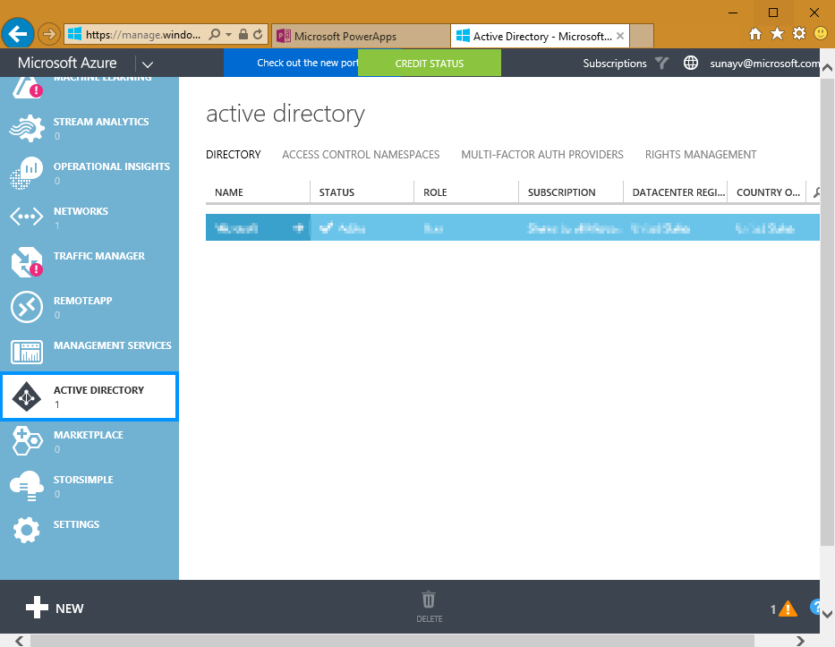
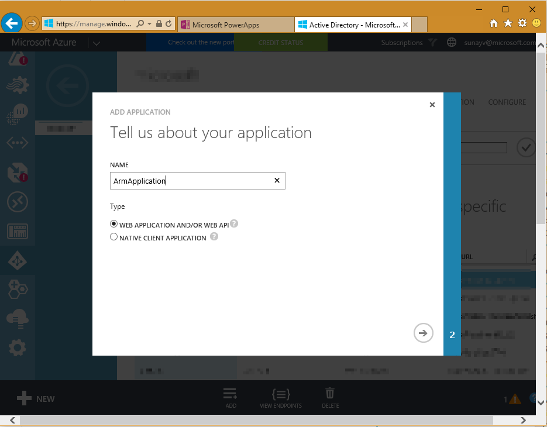
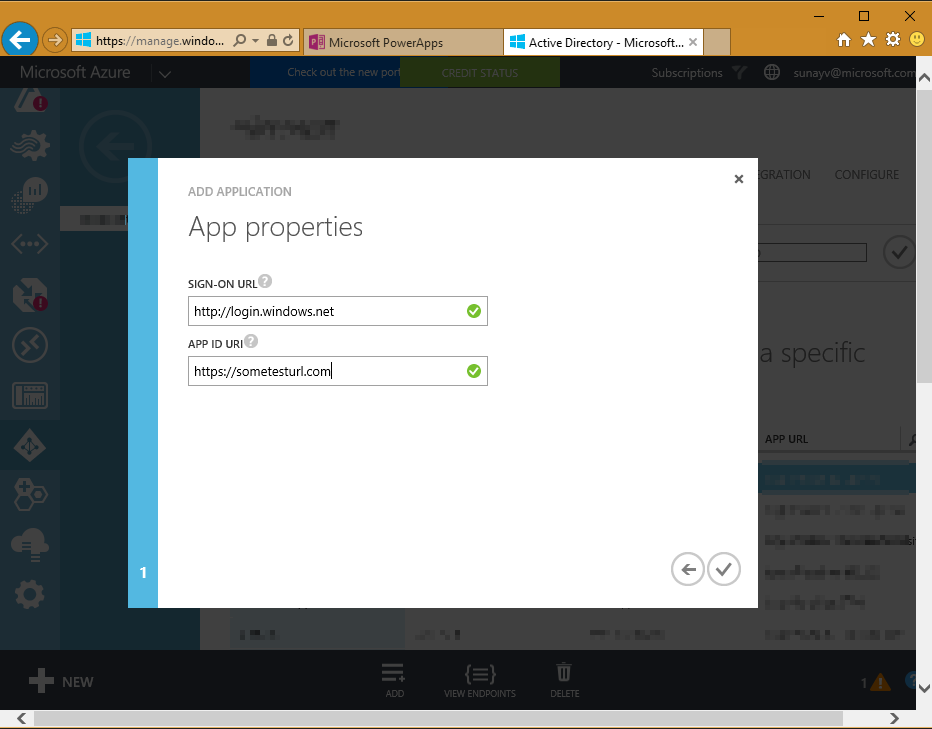
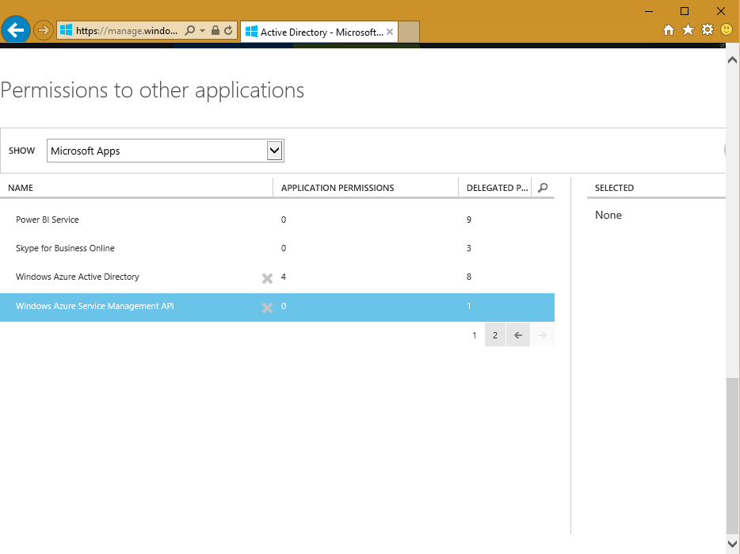
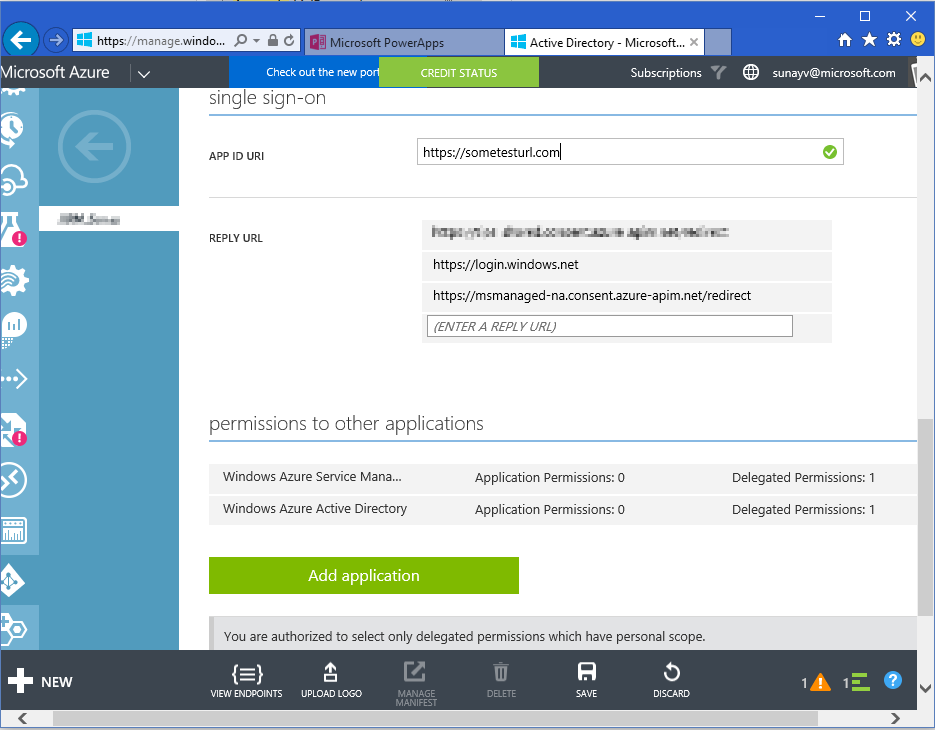
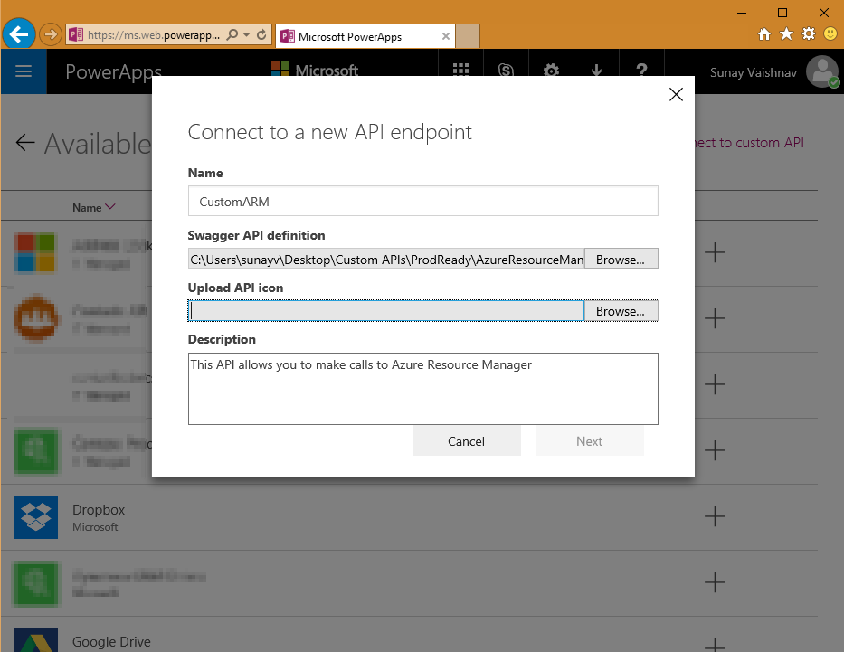
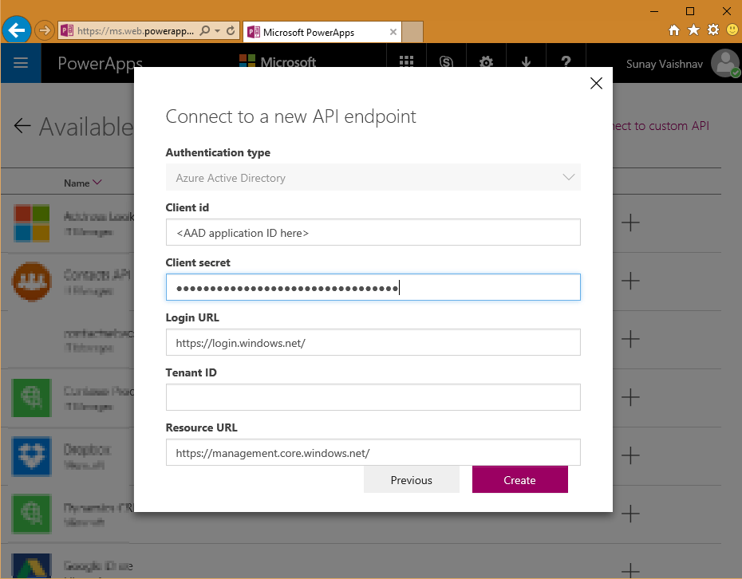
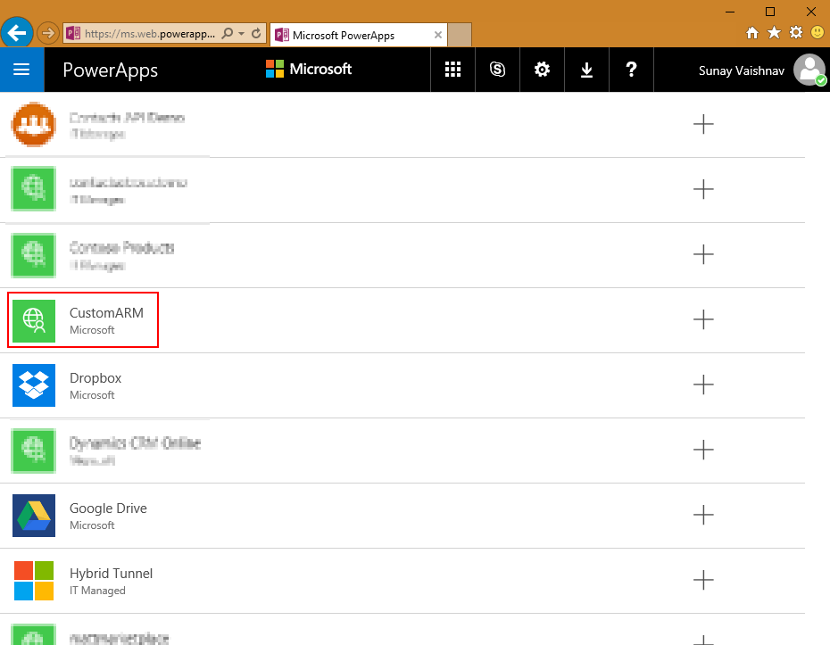

### Azure Resource Manager Sample. 

This tutorial will walk you through the required steps to register a Swagger file describing the [ARM API](https://msdn.microsoft.com/en-us/library/azure/dn790568.aspx) and connect to it in PowerApps. 

##### Pre-requistes

* An Azure subscription
* A PowerApps account

##### Authentication

First off, we need to create an AAD application that will perform on behalf authentication when calling the ARM API endpoint. 

To create an AAD application - Log in to your [Azure subscription](https://management.windowsazure.com) and navigate to Azure active directory.

On this page, choose the directory that you want to create your AAD application in. Once you have selected the correct directory, go to the _Applications_ tab and click _Add_

Type in the name of the application and select __Web application and/or Web API__ radio button

In the __sign-on url__ use: http://login.windows.net. The __APPID uri__ field can be any unique URI. 

Once the AAD application has been created, navigate to the __configure__ tab

Here we will need to configure the permissions the application has. For this tutorial, you will want to set the permissions as shown. 

Next we need to generate a __key__, make sure to copy and save the key in a safe location, we will need this later. At this point it'd also be useful to make a note of the __Client ID__. 

Include the following URL for the __reply-URL__: https://msmanaged-na.consent.azure-apim.net/redirect. 

Once you have successfully set up your AAD application, head on to the [PowerApps Portal](https://web.powerapps.com) and navigate to the Connections tab, click on __Add a connection__ in the top right corner and then click on the __Add a Custom API__ button

Upload the ARM Swagger file, which is available [here](./AzureResourceManager.json)

On the next screen, since our Swagger file was detected to use AAD authentication, we need to provide the correct configuration settings. 

If everything was setup correctly you can use the ARM Custom API by creating a connection and referencing it while building your PowerApp or Logic flow. 

You can similary access any data that is exposed via RESTful APIs and authenticated using AAD OAuth2.

In case you have any questions or comments feel free to reach out to us at [logicappsio@microsoft.com](mailto:logicappsio@microsoft.com)
